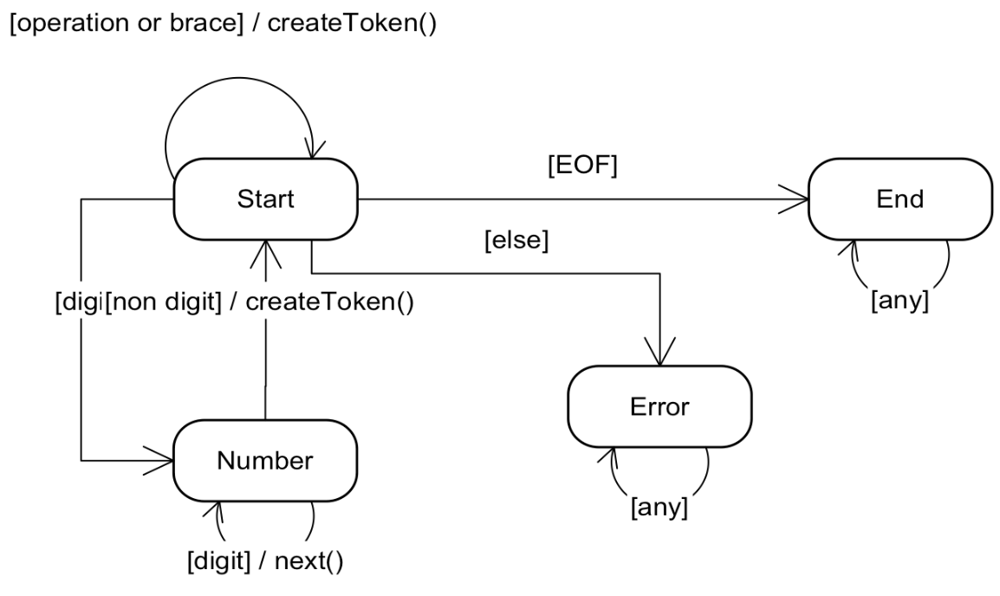

## Лабораторная 6. Calculator

Цель: получить практический опыт применения паттернов поведения visitor и state.

Необходимо реализовать калькулятор, который умеет преобразовывать простые арифметические выражения в обратную польскую
запись (ОПЗ) и вычислять их. Пример выражения:

```
(23 + 10) * 5 – 3 * (32 + 5) * (10 – 4 * 5) + 8 / 2.
```

Выражение может содержать скобки, пробельные символы, цифры и 4 операции: ``+``, ``-``, ``*``, ``/``.

Для вычисления выражения его необходимо сначала разбить на токены:

+ по одному токену на каждую скобку и операцию;
+ токен для целых чисел.

Пример:

```
(30 + 2) / 8 -> LEFT NUMBER(30) PLUS NUMBER(2) RIGHT DIV NUMBER(8).
```

Далее токены преобразуются к ОПЗ, которая уже не содержит скобок и может быть легко вычислена с помощью стека.

```
LEFT NUMBER(30) PLUS NUMBER(2) RIGHT DIV NUMBER(8) ->
NUMBER(30) NUMBER(2) PLUS NUMBER(8) DIV
```

Схема работы калькулятора:


+ входной набор данных разбирается на отдельные токены Tokenizer'ом;
+ ParserVisitor обходит все полученные токены и преобразует их к обратной польской записи;
+ затем токены печатаются PrintVisitor'ом;
+ значение выражения вычисляется СalcVisitor'ом.

Visitor'ы могут использовать стеки и другие структуры данных, чтобы накапливать в себе промежуточные результаты.

Tokenizer проще всего реализовать в виде конечного автомата, который считывает по одному из символов из входного потока
и преобразует их в токены. Сам автомат необходимо реализовать, используя паттерн State. Схема автомата:

Скелет классов:

```java
interface Token {
    void accept(TokenVisitor visitor);
}

interface TokenVisitor {
    void visit(NumberToken token);
    void visit(Brace token);
    void visit(Operation token);
}
```

NumberToken, Brace, Operation реализуют Token. 

Все Visitor реализуют TokenVisitor. 

В итоге необходимо реализовать программу, которая с консоли считывает входное выражение и выводит в консоль сначала выражение преобразованное в
обратную польскую нотации, а затем вычисленное значение выражения. Если было введено некорректное выражение, необходимо
вывести ошибку. 

Подробнее про ОПЗ и преобразования в нее:

https://ru.wikipedia.org/wiki/Обратная_польская_запись
